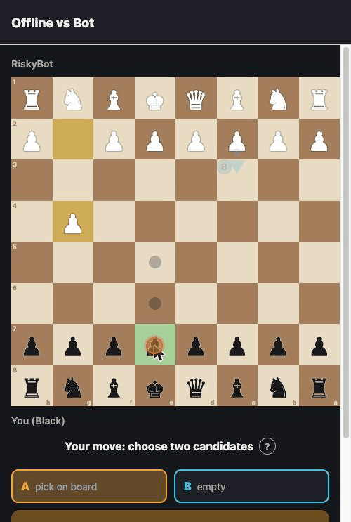
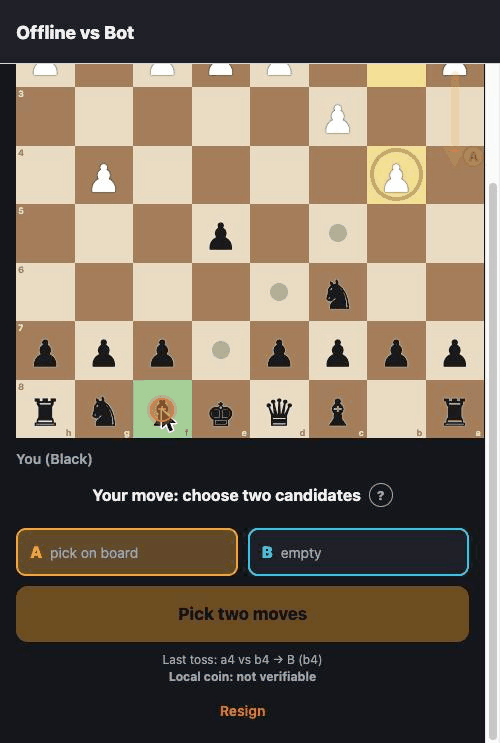
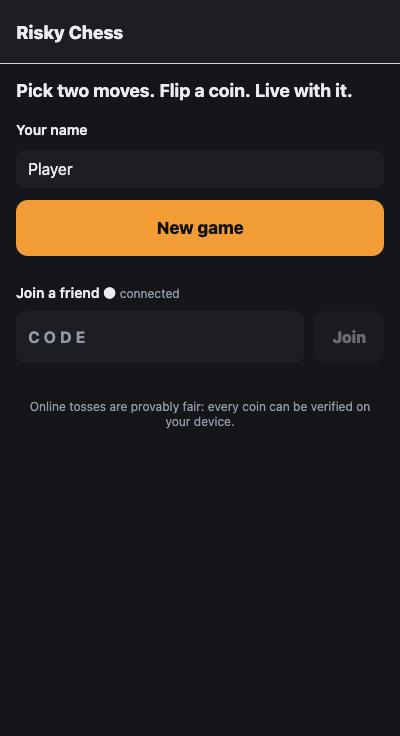
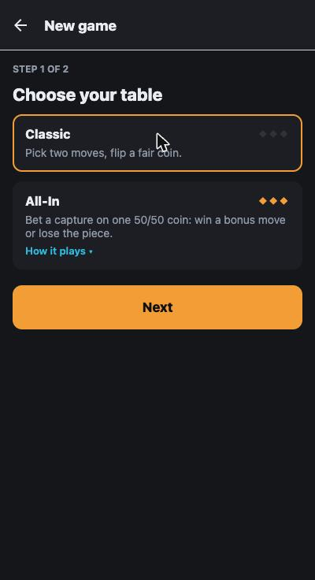
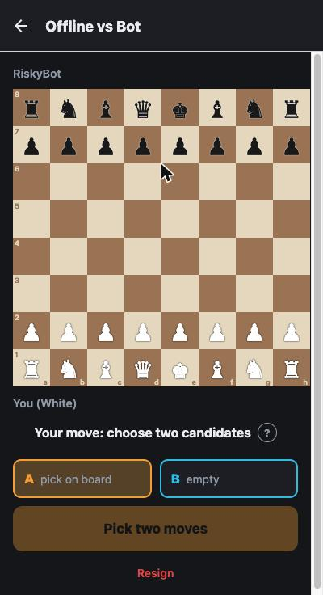
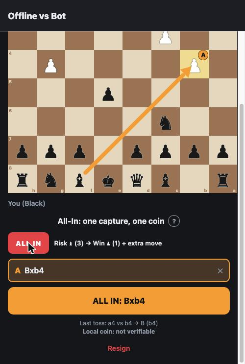
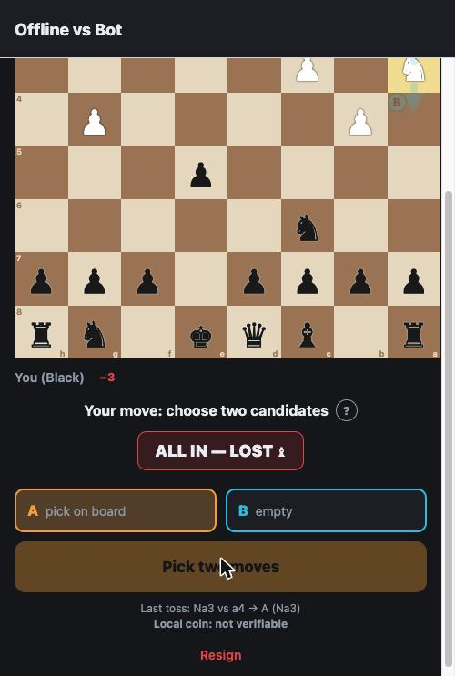
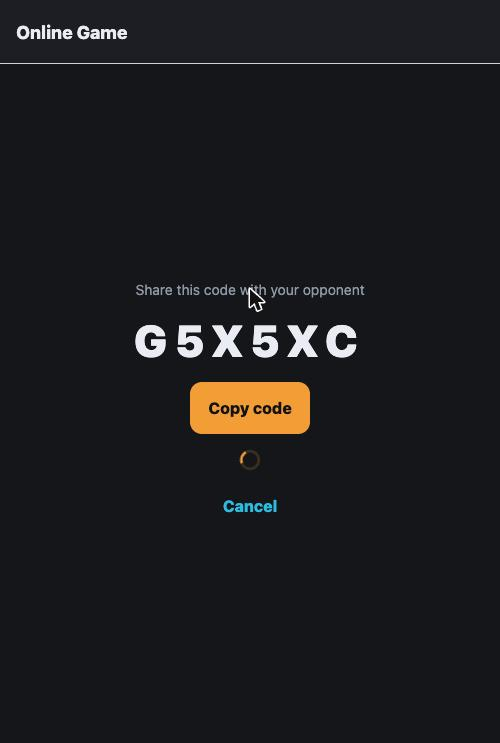

# Risky Chess

Chess where the side to move submits **two** legal moves and a fair coin decides which one is played. Play offline against the bot, or online against a friend through a small game server. Runs on iOS, Android and the web.

## Gameplay

<p align="center">
  
  &nbsp;&nbsp;
  
</p>

<p align="center"><em>Left: two classic turns — pick a pair, toss, live with it. Right: an All-In on Bxb4 that busts, so the bishop comes off.</em></p>

### Screens

| Home | New game | Offline vs bot |
|---|---|---|
|  |  |  |

| Declaring an All-In | After a bust | Inviting a friend |
|---|---|---|
|  |  |  |

## Tech stack

- **Monorepo:** pnpm workspaces, TypeScript
- **Backend:** Node.js, Express 5, Socket.io (authoritative game server, in memory)
- **Frontend:** Expo (React Native + expo-router), Zustand
- **Rules:** custom variant engine on top of `chess.js`, shared by server and app
- **Tests:** Vitest

## Layout

| Package | What it is |
|---|---|
| `packages/shared` | Types, socket event contracts, zod payload schemas, constants |
| `packages/engine` | The variant rules on top of `chess.js` (validation, resolution, end conditions, All-In, bot). Used by both server and app |
| `apps/server` | Express + Socket.io game server for online games |
| `apps/mobile` | Expo (expo-router) app: offline bot mode + online play |

## Rules

- Each turn, the player to move picks two different legal moves (Move A and Move B). Both are validated against the same start-of-turn position: they are alternatives, not a sequence.
- Moves are distinct by long algebraic notation, so `e7e8q` and `e7e8n` are different moves.
- If exactly one legal move exists, it is played without a toss.
- Mate, stalemate and draws are evaluated after the executed move. Repetition counts only executed positions.
- A disconnected player has 60 s to rejoin before forfeiting. A turn submitted before the drop still resolves.
- Online tosses are provably fair (commit-reveal): the server commits to `sha256(serverSeed)` before the turn, the mover adds a client seed, and the roll is `HMAC-SHA256(serverSeed, "gameId:turn:clientSeed")` mapped uniformly to 0–9999. The app re-verifies every toss (see the Fairness screen). Offline games use a local, unverifiable coin.

### Tables

| Table | In two sentences |
|---|---|
| **Classic** | Pick two moves, flip a fair coin. That's it. |
| **All-In** | Instead of a pair, declare one capture on a fair 50/50 coin. Win: it plays and you move again (unless it checks or ends the game); lose: nothing is played and your capturing piece is removed. Once per piece type, never the king. |

## Getting started

### Prerequisites

- Node.js (a recent LTS)
- pnpm, pinned via `packageManager`. If `pnpm` isn't on your PATH, run `corepack enable`.
- For the app: a browser, [Expo Go](https://expo.dev/go) on your phone, or an iOS simulator / Android emulator.

### Install and run

```sh
pnpm install

pnpm dev:server    # http://localhost:3001 (only needed for online games)
pnpm dev:mobile    # Expo dev server: press w for the web, or open in Expo Go
```

Offline play needs no server at all. For online play, start the server, create a game on one device and share the six-letter code.

### Hosting for free

- **App, web:** `cd apps/mobile && npx expo export --platform web` produces a static `dist/` you can put on GitHub Pages, Cloudflare Pages, Netlify or Vercel. Set `EXPO_PUBLIC_SERVER_URL` at build time to point online play at your server.
- **Server:** one Node process with no database. Any free Node host (Fly.io, Railway, Render) runs `pnpm --filter @risky-chess/server start`; games live in memory, so a restart ends games in progress.

### Scripts

| Command | What it does |
|---|---|
| `pnpm dev:server` | Start the game server with hot reload |
| `pnpm dev:mobile` | Start the Expo dev server |
| `pnpm test` | Run engine + server tests |
| `pnpm typecheck` | Type-check every package |

## Configuration

```sh
cp apps/server/.env.example apps/server/.env   # PORT
cp apps/mobile/.env.example apps/mobile/.env   # EXPO_PUBLIC_SERVER_URL
```
